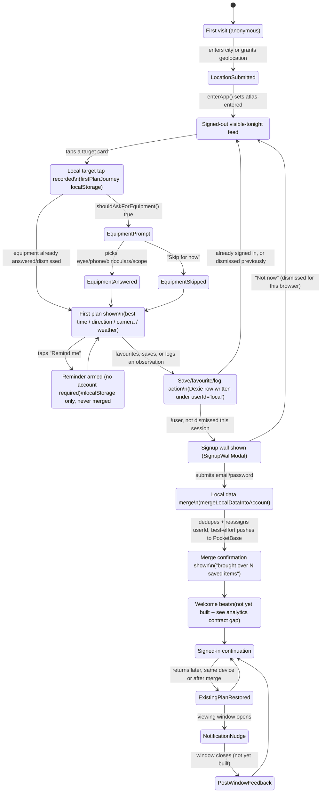

# First-plan journey: account lifecycle (STS-332)

States from anonymous first visit through signed-in continuation, covering
the local-first data (target taps, equipment, favourites, plans, observation
notes) and where it does or doesn't survive a transition. Grounded in the
actual implementation as of this session:

- `src/lib/firstPlanJourney.ts` — target taps + equipment, plain `localStorage`
- `src/lib/db.ts` (Dexie) — favourites/watchlist/observations/camera presets,
  scoped by a fixed `'local'` user id until signup
- `src/lib/accountMerge.ts` — the local → account merge, run on signup
- `src/lib/getReadyReminders.ts` — reminders, account-independent, always
  `localStorage`-only (never migrated, since they're not scoped by user id)

## What does and doesn't survive each transition

| Data | Where it lives signed out | On signup | On sign-in (existing account, new device) |
|---|---|---|---|
| Target taps | `localStorage` (`firstPlanJourney.ts`), never partitioned by user | Nothing to migrate — same `localStorage` key is read before and after signup, so it's never orphaned, just device/browser-scoped | Not restored on a new device — device-specific by design, no backend collection for it |
| Equipment choice | `localStorage`, never partitioned by user | Same as target taps | Not restored on a new device |
| Favourites | Dexie, `userId: 'local'` | Reassigned to the new user id, deduped, pushed to PocketBase (`accountMerge.ts`) | Pulled from PocketBase normally (existing sync path) |
| Watchlist | Dexie, `userId: 'local'` | Reassigned + deduped + pushed | Pulled normally |
| Observation notes | Dexie, `userId: 'local'` | Reassigned + pushed | Pulled normally |
| Camera presets | Dexie, `userId: 'local'` | Reassigned + deduped | Pulled normally |
| Get-ready reminders | `localStorage` (`getReadyReminders.ts`), never partitioned by user | Same as target taps — nothing to migrate | Not restored on a new device |

STS-322's "no local first-journey data is orphaned after signup" holds for two
different reasons: the Dexie-backed rows (favourites/watchlist/observations/
presets) are actively reassigned by `mergeLocalDataIntoAccount`, while target
taps/equipment/reminders were never partitioned by user id in the first place
— there's no `'local'` vs `<userId>` split for them to fall out of, so signing
up can't orphan them. They stay device-scoped rather than becoming account
state, which matches the acceptance criteria's actual concern (nothing
silently disappearing on signup) without inventing new backend collections
this session didn't call for.
