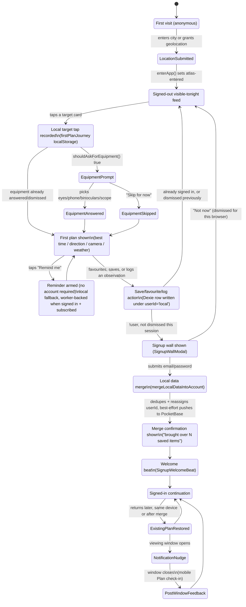

# First-plan journey: account lifecycle (STS-332)

States from anonymous first visit through signed-in continuation, covering
the local-first data (target taps, equipment, favourites, plans, observation
notes) and where it does or doesn't survive a transition. Grounded in the
actual implementation as of this session:

- `src/lib/firstPlanJourney.ts` — target taps + equipment, plain `localStorage`
- `src/lib/db.ts` (Dexie) — favourites/watchlist/observations/camera presets,
  scoped by a fixed `'local'` user id until signup
- `src/lib/accountMerge.ts` — the local → account merge, run on signup
- `src/lib/getReadyReminders.ts` — reminders, stored locally for every user
  and pushed to `atlas_get_ready_reminders` for signed-in users with a push
  subscription so the scheduled worker can deliver them

## Free / paid boundary

The first walkthrough and essential observation loop are free for every user:
location entry, visible-tonight feed, first target tap, equipment prompt, first
plan summary, check-ins, private observation logging, every local event type up
to two weeks ahead, and local light-pollution estimates for today and tomorrow.

Sky Pass starts when a user turns browsing into a saved plan: adding watched
targets, arming future-event reminders, planning for other locations, unlimited
light-pollution comparison, lower-light-pollution trip routing, gear-fit
planning, downloadable camera preset bundles, device-specific setup steps, and
deeper camera recommendations. The compact first-plan `CameraPresetCard`
remains free because it is part of the essential walkthrough answer.

## What does and doesn't survive each transition

| Data | Where it lives signed out | On signup | On sign-in (existing account, new device) |
|---|---|---|---|
| Target taps | `localStorage` (`firstPlanJourney.ts`), never partitioned by user | Nothing to migrate — same `localStorage` key is read before and after signup, so it's never orphaned, just device/browser-scoped | Not restored on a new device — device-specific by design, no backend collection for it |
| Equipment choice | `localStorage`, never partitioned by user | Same as target taps | Not restored on a new device |
| Favourites | Dexie, `userId: 'local'` | Reassigned to the new user id, deduped, pushed to PocketBase (`accountMerge.ts`) | Pulled from PocketBase normally (existing sync path) |
| Watchlist | Dexie, `userId: 'local'` | Reassigned + deduped + pushed | Pulled normally |
| Observation notes | Dexie, `userId: 'local'` | Reassigned + pushed | Pulled normally |
| Camera presets | Dexie, `userId: 'local'` | Reassigned + deduped | Pulled normally |
| Get-ready reminders | `localStorage`; when signed in with push support, also `atlas_get_ready_reminders` | Existing local reminders stay local; newly created signed-in reminders are worker-backed | Worker-backed notification can still fire through push subscription; in-app check-in remains device-local unless the reminder exists in this browser |

STS-322's "no local first-journey data is orphaned after signup" holds for two
different reasons: the Dexie-backed rows (favourites/watchlist/observations/
presets) are actively reassigned by `mergeLocalDataIntoAccount`, while target
taps/equipment were never partitioned by user id in the first place. Reminders
remain visible locally and, once created while signed in with push support, are
also mirrored to PocketBase for worker delivery.
