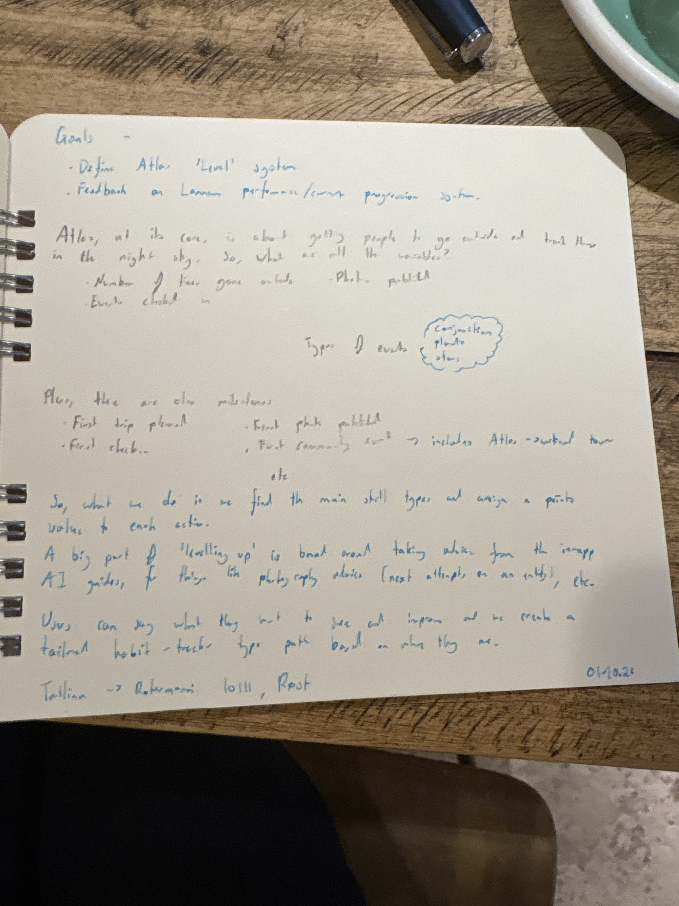

# Atlas Level / Training System (Coasthack, Oct 2026)

## Liam's notes (1 Oct 2026)

### Goals

- Define Atlas 'Level' system
- Feedback on Landnam performance / current progression system

Atlas, at its core, is about getting people to go outside and track things in the night sky. So, what are all the variables?

- Number of times gone outside
- Photos published
- Events checked in

Types of events: conjunctions, planets, stars

Plus, there are also milestones:

- First trip planned
- First check-in
- First photo published
- First community event (includes Atlas-curated tour)
- etc.

So, what we do is we find the main skill types and assign a points value to each action.

A big part of 'levelling up' is based around taking advice from the in-app AI guides, for things like photography advice (next attempts on an entity), etc.

Users can say what they want to get and improve, and we create a tailored habit-tracker type path based on what they are.

Tallinn → Rotermanni 10/11, Rest (location note)

## Investigation

Atlas already records the nights, photos, plans, and one badge a level system needs. It has no points ledger, no level, and no personal path. The closest things in the repo are a weekly streak, a First light tour badge, and journal stats derived from check-ins.

This investigation was read-only. The findings below describe the repo as it stood on 1 Oct 2026, before this design note was added.

### 1. Architecture

Atlas is one Vite + React 19 + TypeScript app, installable as a PWA. There is no `packages/` workspace. The layout is a single frontend plus a few side processes.

| Piece | Where | Role |
| --- | --- | --- |
| App shell and routes | `src/App.tsx`, `src/AppShell.tsx`, `src/main.tsx` | Landing, `/hosts`, and `/app/{hub,events,calendar,planner,journal,ask,profile}`. Public cards live at `/p/:remoteId` and `/stamps/:slug`. |
| Domain logic | `src/lib/` | Check-ins, trips, streaks, sync, analytics, camera recipes, guides. |
| Screens | `src/pages/`, `src/components/`, `src/views/` | Current product is the pages. Several `src/views/` screens are leftover and not mounted. |
| Local data | `src/lib/db.ts` | Dexie database `atlas`. Writes land here first. |
| Remote data | `src/lib/pocketbase.ts`, `src/lib/sync.ts` | PocketBase JS SDK. Production API is the shared Star Sailors instance `https://signal-k-starsailors.fly.dev`. |
| Auth | `src/components/AuthForm.tsx`, `pocketbase/pb_hooks/clerk-exchange.pb.js` | Clerk widget, then `POST /auth/clerk-exchange`, which becomes a PocketBase `users` session. Identity is the Star Sailors user. Clerk is the login provider. |
| Billing | `src/lib/entitlement.ts`, `src/lib/pocketbase.ts` | Sky Pass is a Polar one-time purchase, served by a separate atlas-billing service. The fallback product belongs to the Polar org "Landnam Ventures". |
| Photos | `workers/atlas-media/src/index.ts`, `src/lib/atlasMedia.ts` | Cloudflare Worker plus R2. PocketBase keeps ownership and metadata. |
| Analytics | `src/lib/analytics.ts`, `functions/uplink/[[path]].ts` | `posthog-js`, proxied through `/uplink` so blockers do not drop capture. |
| Sky catalogue | `scripts/ingest.mjs`, `scripts/seed-curated-window.mjs` | A scheduled job upserts a 14-day window into `sky_events`. It does not run inside the app. |
| PocketBase hooks in this repo | `pocketbase/pb_hooks/` | CI and local sandboxes. The file header in `clerk-exchange.pb.js` says production exchange lives in the shared Go backend, which is not in this repository. |

`README.md` still describes a widget registry at `src/widgets/registry.ts`. That file is gone. The live shell is `AppShell`. `DigestWidget` and `LeaderboardWidget` survive only inside the Journal Community tab (`src/components/mobile/JournalCommunity.tsx`).

Offline behaviour matters for any points design. Observations are saved to IndexedDB before the network call. `pushObservation` in `src/lib/sync.ts` is best-effort. A failed push stays on the device. Guests write under the user id `local`, and `src/lib/accountMerge.ts` copies that into the account on signup.

### 2. Where each XP input already exists

Nothing in the app awards points. Several actions are already rows you can count. PostHog is a weak source of truth for this: Atlas shares a project with Landnam, and `docs/first-plan-funnel-analytics-contract.md` says Landnam game events dilute funnels unless you filter `$host = youratlas.cc`. Count PocketBase and Dexie rows. Use PostHog to see whether people do the thing.

#### Nights outside

The product name is "Nights out". `src/pages/JournalPage.tsx` counts unique `observedAt` dates on the signed-in user's local observations. There is no GPS session that proves someone went outside. A check-in is a journal entry.

| Layer | What you can count |
| --- | --- |
| Local | Dexie `observations` in `src/lib/db.ts` (`ObservationLogEntry`) |
| Remote | `atlas_observations` (`observed_at`, `location_label`, `user`) |
| Writers | Tonight: `src/components/mobile/CaptureSheet.tsx`. Past night: `src/components/mobile/PastCheckInSheet.tsx` and `src/lib/checkInReview.ts` |
| Rules | `src/lib/checkInRules.ts`. Tonight is photo-optional for everyone. A free user backdating a night must attach a photo. Pending review rows must not count: `countsTowardCityStamp` in `src/lib/cityStamps.ts` already excludes them. |
| PostHog | `Logged observation` (`hasTarget`, `rating`, `hasPhoto`, `source`) from CaptureSheet and Hub. `Checked in to a past night` from `checkInReview.ts`. |

`atlas_city_stamps.checkin_count` is per city, incremented in `pushCityStampFromObservation`. It is a place tally, not a lifetime night count, and a failed stamp write does not roll back the journal entry.

#### Photos published

Attaching a photo and publishing it are different states.

- A photo on a check-in is `ObservationLogEntry.photo`, then `photo_r2_key` / `photo_r2_size` on `atlas_observations`, uploaded by `workers/atlas-media`.
- Publishing flips `public: true` in `shareObservation` (`src/lib/sharing.ts`), opened from `src/components/mobile/JournalSheets.tsx`. The public page is `/p/:id` (`src/views/SharePage.tsx`).
- Photo challenges are a second publish path: `atlas_photo_challenge_submissions` via `submitPhotoChallenge` in `src/lib/photoChallenges.ts`, with `approved` defaulting false until `scripts/moderate-photo-challenges.mjs` surfaces them. The live UI is `ChallengeSubmitSheet` inside Journal Community. `src/views/PhotoChallengesView.tsx` is not routed.
- Discoveries (`atlas_discoveries`, votes, reactions, comments) are written by `src/lib/discoveries.ts` and listed in Journal Community. `src/views/FeedView.tsx`, the create form, is not mounted, so new discoveries from the current shell are unlikely.

PostHog: `Logged observation` carries `hasPhoto`. `Viewed public share card` fires from `SharePage.tsx`. The metric guide's `Shared public card` and `Shared city stamp` events are documented in `docs/atlas-analytics-metric-guide.md` and `docs/first-plan-funnel-analytics-contract.md` as coming from `PostShareDialog`, but that component only captures `post_share_link_failed`. `shareCityStamp` in `src/lib/cityStamps.ts` has no caller. A published photo is countable from `atlas_observations.public`, not from those event names.

#### Events checked in, and their types

A check-in can point at a sky event through `eventId` / `atlas_observations.event`. Past check-ins whose match is a generated id omit that relation on purpose (`pushObservation` in `src/lib/sync.ts`) and keep the title in `target_name` plus `event_snapshot` on the review queue `atlas_checkin_review_queue`.

Provenance fields already on the row: `check_in_kind` (`tonight` | `past`), `matched_by`, `match_confidence`, `anchor_source`.

Event kinds the browser understands are in `src/lib/eventCategories.ts`:

- Moon and eclipses: `moon_phase`, `eclipse`
- Planets and conjunctions: `planet_event`, `conjunction`
- Meteors: `meteor_shower`, `fireball`
- Satellites: `iss_pass`, `satellite_flare`
- Aurora: `aurora`, `solar_flare`
- Stars and deep sky: `bright_star`, `deep_sky`, `telescope_target`
- Asteroids: `asteroid_approach`
- Guides, which are not dated events: `comet`, `night_sky_guide`, `local_night_sky`

The curated ingest (`scripts/seed-curated-window.mjs`) only writes moon phases, meteor showers, eclipses, planet events, conjunctions, and asteroid approaches into `sky_events`. Conjunctions come from `src/lib/eventSources/conjunctions.mjs` (`kind: 'conjunction'`). Planets come from `src/lib/eventSources/planets.mjs` (`kind: 'planet_event'`, oppositions and elongations). Stars and deep-sky objects are client catalogues (`src/lib/visiblePlanets.ts`, `src/data/brightStars.ts`, `src/data/messierCatalog.ts`), so a "star check-in" often has a `target_name` and sometimes no `sky_events` row.

`Logged observation` does not include `kind`. `first_plan_target_tapped` does (`src/lib/firstPlanJourney.ts`). Kind for a saved check-in has to be joined from `sky_events` or read off `target_name`.

#### Trips and plans

There are two trip models.

- `src/lib/trips.ts` stores holiday windows in `localStorage` (`atlas-trips`). No server row, no analytics event. Used as a location override and as a past-check-in anchor (`anchor_source: 'trip'`).
- `src/lib/tripPlans.ts` is the real plan: one `atlas_trip_plans` row per user (legs, equipment, interests, generated guides). Saving fires `Saved trip plan` from `src/components/mobile/ItineraryBuilderSheet.tsx`. Deleting fires `Deleted trip plan`. This is Sky Pass (`src/pages/PlannerPage.tsx`).

"First trip planned" can be the first `atlas_trip_plans` create, or the first `Saved trip plan` event. The localStorage trips will not show up in that count.

#### Community events and Atlas-curated tours

`src/views/HostPage.tsx` (`/hosts`) is a marketing page for free public sky nights. The only action is `mailto:liam@skinetics.tech`. `Viewed host page` is the only analytics event. There is no event record, RSVP, ticket, or check-in for a community night.

The in-app "tour" is a different thing: the Tonight guided look, id `tonight-first-light-v1`, in `src/lib/tourJourney.mjs` and `src/lib/tourProgress.ts`. Completion is stored in `localStorage` and copied to `users.first_tour_completed_at` and `users.first_tour_badge = 'first_light'`. PostHog events: `Tour started`, `Tour step viewed`, `Tour completed`, `Tour abandoned`, `Incentive unlocked` (`type=first_tour`, `badge=first_light`), `Tour shared`, `Tour share opened`, `Return nudge shown`. Contract: `docs/first-plan-funnel-analytics-contract.md`.

That badge can be the "first guided session" milestone. It cannot stand in for "first community event" or an Atlas-curated tour in Tallinn. The notebook's Rotermanni note is a place and date, and the product has nowhere to attach it.

#### In-app AI guides, and "taking advice"

Several guides exist. None of them record that the advice was followed.

| Guide | Code | Persistence | Analytics |
| --- | --- | --- | --- |
| Phone camera recipes | `src/lib/cameraRecipes.ts`, `src/components/CameraRecipe.tsx`, live notes in `describeLiveConditions` | If the user logs from an event sheet, `camera_recipe_used` is copied onto the observation (`HubPage.tsx`, `EventsPage.tsx`, CaptureSheet). A blank journal log does not set it. | `Opened camera recipe`, `Imported camera preset`, `Changed device profile` |
| Eclipse / meteor steps | `src/lib/eventGuide.ts` | Computed at read time | None |
| Trip guide | `src/lib/tripGuide.ts`, hook `pocketbase/pb_hooks/trip-guide.pb.js`, route that calls Claude | Saved on the plan as `guide_json` | `Generated trip guide` |
| Ask Atlas | `src/pages/AskAtlasPage.tsx`, `src/components/AskAtlas.tsx`, `src/lib/ai.ts`, `POST /atlas/ask` | Nothing is stored | `ask_atlas_failed` only |
| AI photo caption | `src/lib/photoCaption.ts`, `pocketbase/pb_hooks/photo-caption.pb.js` | `atlas_observations.ai_caption` | None on success |
| Scrapbook prompt and caption suggestion | `src/lib/scrapbookPrompt.ts`, `src/lib/observationCaptionSuggestion.ts` | The suggestion is editable text, not a record of advice | None |

Ask Atlas, trip guides, and photo captions all require `ANTHROPIC_API_KEY` and Sky Pass. The hooks say a deployment without the key rejects every call. `docs/posthog-product-analysis-2026-07-21.md` already found camera recipes barely used (two `Opened camera recipe` events in that snapshot).

The notebook's "next attempt on an entity" loop is not built. The nearest join is: user opened recipe R, then later saved an observation with `camera_recipe_used = R` and the same target.

#### "What I want to get better at"

This is collected, then thrown away as product state.

- Onboarding purpose chips in `src/lib/onboardingSurvey.ts`: knowing what to look for tonight, learning the sky, telescope sessions, photographing the sky, rare events, sharing. Answers go to a PostHog survey (`survey sent` / `Onboarding survey submitted`). Local storage only remembers that the survey was shown or submitted, not the choices.
- `users.experience_level`: `beginner | casual | experienced | expert` (`src/lib/onboarding.ts`, written by `syncOnboardingToAccount` in `src/lib/auth.ts`).
- `users.viewing_instruments`, `users.in_astro_club`, `users.astro_club_name`.
- Event-type favourites: Dexie `favourites` and `atlas_favourites`, via `src/lib/eventPreferences.ts`.
- Trip-plan `interests_json`: category ids from `EVENT_CATEGORIES`.
- First-plan equipment choice (`eyes | phone | binoculars | telescope`) stays in `localStorage` (`src/lib/firstPlanJourney.ts`) and is counted in the signup merge, not stored as a path.

### 3. Progression that already exists

There is no XP, level table, skill track, or habit path.

What does exist:

- **Weekly streak.** `src/lib/streaks.ts` writes Dexie `streaks` and `atlas_streaks` (`current_weeks`, `longest_weeks`, `last_logged_week_start`). One week of either a login-style activity call or an observation advances it. It is not a nightly "went outside" streak. `recordWeeklyActivity` runs from tonight's CaptureSheet save, from a past check-in only when that night falls in the current ISO week (`checkInReview.ts`), and from opting into the leaderboard (`src/components/LeaderboardSettings.tsx`), which increments the streak without an observation. Backdated nights are deliberately kept out so a 2019 check-in cannot reset a live streak.
- **Streak leaderboard.** `src/lib/leaderboard.ts`, collection `atlas_streak_leaderboard_entries`. Opt-in display name is `localStorage` key `atlas-leaderboard-name`. Shown in Profile (`src/pages/ProfilePage.tsx`) and Journal Community. Rank is current streak weeks.
- **First light badge.** The only badge. `users.first_tour_badge`, surfaced on the Hub (`src/pages/HubPage.tsx`). It celebrates once.
- **City stamps.** `atlas_city_stamps`: `city_key`, `checkin_count`, first and last check-in, `public`, `share_slug`.
- **Journal stats.** Nights out, "First seen" (count of distinct `targetName` values, not a first-sighting log), and places. All derived in the browser in `JournalPage.tsx`. Profile shows none of this.
- **Attempt rating.** `poor | ok | good | great` on the observation. Useful later as a quality signal. It is not points.
- **Challenge approval and discovery votes.** Social proof, not progression.

`docs/atlas-journal-and-scrapbook-feature-description.md` already asks for nights observed, first sightings, categories completed, locations, and challenge participation, and it says the journal should stay a memory first. The notebook wants the opposite emphasis. Both can share the same rows. The Profile and the moment after a check-in are the right places for levels. The diary list should stay a diary.

#### Landnam

This repository contains no Landnam progression, quest, or XP code. The overlap that does exist:

- Shared Star Sailors PocketBase. `src/lib/pocketbase.ts` points at the same cold-start behaviour as `Landnam/web/lib/contexts/useAuthSync.ts`, which is not in this repo.
- Shared PostHog project. Landnam game events are why every Atlas funnel filters on host. A level system that awards from PostHog event names would mix game events into astronomy progress.
- Polar billing under the org name Landnam Ventures (`src/lib/entitlement.ts`).

Atlas streaks (`atlas_streaks`) are Atlas collections on that shared database. They are not a shared game progression table. Copying Landnam's loop into Atlas would fight the journal doc and the host-filter lesson. The useful lesson from Landnam is the one already written down: keep products apart at query time, on a shared backend.

### 4. Proposed integration

Compute a progress snapshot in the client from rows Atlas already trusts, and show it on Profile and immediately after a check-in. Add a small append-only ledger only after the demo is real, because new PocketBase collections are migrations on the shared Star Sailors database, and those migrations are not in this repo.

#### Where it lives

- **Pure rules:** a new `src/lib/progress.ts` (name up to you) that turns observations, the trip plan, and the First light badge into points, milestones, and a level. No network. Unit-test it the way `src/lib/streaks.ts` is tested.
- **Snapshot read model:** derive on the Profile and Journal screens from Dexie, the same way Nights out is derived today. That works offline and for guests under `local`, and `accountMerge.ts` already moves guest observations across.
- **Ledger, when you need history:** `atlas_xp_ledger`, one row per awarded action, written beside the existing save (CaptureSheet, past check-in approval, `shareObservation`, `saveTripPlan`, `completeFirstTour`). Idempotency key `user + action + source_id` so a retry cannot double-award. Do not also award inside a projector or the two will disagree.
- **Path:** `atlas_training_paths`, one row per user, or a JSON field on `users` if a new collection is too heavy for the week. Steps are generated from experience level, favourite categories, and the purpose chips. Those chips have to be stored on the account. Today they exist only inside the PostHog survey payload.

Keep awarding on the server out of the hackathon. The shared backend is the enforcement point for auth, and check-in policy is explicitly client-side today (`checkInRules.ts` says there is no server counterpart). A client ledger matches that. It is also forgeable. That is acceptable for a Coasthack demo and a poor fit for anything that later gates Sky Pass.

#### Point table to start from

One skill per action. Level is total points, with a short curve (for example 0, 40, 100, 180, 300) so a single night cannot finish the game and a week of real use can reach level 2.

| Action | Skill | Points | Count it when |
| --- | --- | --- | --- |
| Night out | Observing | 10 | One qualifying observation per civil date. `reviewStatus` in `undefined`, `not_required`, `approved`. |
| Check-in on a typed event | Observing, split by category | +5 | `eventId` joins to `sky_events.kind`, or `target_name` maps through `recipeKeyForEventKind`. Conjunction, planet, and star are the three notebook types. Use `categoryForKind`. |
| Photo attached | Photography | 8 | `photo` or `photo_r2_key` present. Once per entry. |
| Photo published | Photography | 15 | `public === true` or an approved `atlas_photo_challenge_submissions` row. |
| Trip planned | Planning | 20 once, then 5 per extra leg | First `atlas_trip_plans` save. Ignore `localStorage` trips until they sync. |
| First light tour | Planning | 15 | `users.first_tour_badge`. |
| Advice followed | Photography or the matching skill | 12 | `camera_recipe_used` equals a recipe opened for that target, or a trip guide exists for a leg and a later check-in uses that leg's city as `anchor_source: 'trip-plan'`. |
| Community night | Community | 25 | No source yet. A manual "I went to a sky night" with a host-city label is the honest stub. |

Do not award from streak weeks. Opting into the leaderboard already calls `recordWeeklyActivity` with no observation.

#### Milestones

Derive, do not store, until you need a celebration that survives reinstall:

- First trip planned: earliest `atlas_trip_plans` row, or `Saved trip plan` if you only have the client.
- First check-in: earliest qualifying observation.
- First photo attached, then first photo published. The notebook says "published". Showing both avoids awarding a private phone shot as a publication.
- First guided look: First light badge. Label it as the in-app tour.
- First community night: blocked on a real attendance row. Leave the slot empty in the UI rather than marking the guided tour as a community event.

#### API and hooks

For the demo, no new route. Call the projector from Profile and from CaptureSheet after `db.observations.add`.

When the ledger exists, the write belongs next to the domain write, not in a React effect that re-runs on navigation:

- `pushObservation` / CaptureSheet success
- `reconcileApprovedStamps` when a review flips to approved
- `shareObservation` and `submitPhotoChallenge`
- `saveTripPlan`
- `completeFirstTour`

PostHog, filtered to Atlas: `Progress awarded` (`action`, `skill`, `points`, `event_kind`) and `Milestone unlocked` (`milestone`). Those are for Liam's funnel, not for the user's score.

#### UI

- **Profile (`src/pages/ProfilePage.tsx`).** The page is account, Sky Pass, and settings. Add a level card above Personal: level, points to next level, four skill meters, milestone list. The streak leaderboard stays where it is.
- **After check-in.** CaptureSheet already toasts "Session logged." Replace that with the points just earned and the next milestone. Same beat on the past-check-in sheet when the entry counts immediately. Pending review should say the night counts after it is approved.
- **Hub.** The First light strip is the celebration pattern to copy. A single "next step on your path" card under the tonight stats is enough. Do not turn the sky map into a streak, which the tour copy in `HubPage.tsx` already refuses to do.
- **Journal.** Leave Nights out / First seen / Places. A level chip in the header is enough. The entry list stays a diary.
- **Path editor.** Reuse the onboarding chips (`ONBOARDING_SURVEY_CHOICES`) plus `EXPERIENCE_LEVELS` and `InterestsPicker`. Three steps, habit-tracker shaped: "This week, log one conjunction", "Open the planet recipe, then check in", "Plan one stop". Regenerating the path when interests change is the whole personalisation.

Guest progress stays on the device and merges on signup, same as observations. Sky Pass actions (multi-leg plans, Ask Atlas, AI captions) can bonus the path. The core night-out score has to work on the free tier, because tonight's check-in is free.

### 5. Hackathon tickets

Ordered so a Profile level and a post-check-in award can be demoed before the later tickets. Sizes are surface area: **S** one module and its tests, **M** data plus one screen, **L** a shared PocketBase migration.

1. **Progress rules and level curve (S).** A pure function from observations, one trip plan, and the First light badge to points, skill totals, level, and milestones. Table as above. Tests cover a pending review (no points), two check-ins the same night (one night-out), a private photo versus `public: true`, and a backdated night in another week (points yes, streak untouched).

2. **Profile level card (M).** Read the projector on `ProfilePage`. Show level, next threshold, skill meters, and the four notebook milestones, with community night visibly locked. Empty state for a new account tells them to log tonight.

3. **Award beat after check-in (S).** CaptureSheet and the past-check-in success path show what this save just added. Pending review copy stays honest. No new collection.

4. **Skill split by sky type (S).** Join `eventId` to local `skyEvents.kind` and fall back to `target_name` / `recipeKeyForEventKind`. Conjunction, planet, and star show as their own lines under Observing. Guides (`night_sky_guide`) do not score as sightings.

5. **Persist "what I want to get better at" (S).** Write the onboarding purpose chips to the account (or Dexie if the `users` migration cannot land). `onboardingSurvey.ts` currently drops the choices after the PostHog call. Without this, ticket 6 has nothing personal to read.

6. **Three-step path card (M).** From experience level, favourite categories, and those chips, build three concrete steps and render them on the Hub. Completing a step is the same projector as ticket 1 (a matching check-in, recipe, or plan), not a separate checkbox table.

7. **Advice-followed bonus (M).** Record `Opened camera recipe` locally with the recipe key and target. If a later observation stores that `camera_recipe_used`, award the photography bonus once per entry. This is the notebook's "next attempt" without turning on Claude. Ask Atlas stays out until `ANTHROPIC_API_KEY` is actually on.

8. **Analytics for the demo (S).** `Progress awarded` and `Milestone unlocked` through `trackEvent`, with the existing `$host = youratlas.cc` filter documented next to `docs/first-plan-funnel-analytics-contract.md`. Fix or delete the stale `Shared public card` / `Shared city stamp` names so published photos are not "counted" from events that do not fire.

9. **Community-night stub (S, after the demo works).** One action, "I went to a sky night", storing a label and date on an observation (`anchor_source` already has `manual`). Award the community skill. A real RSVP for Rotermanni is a later product. The host page can deep-link into that action. It should not pretend a mailto is attendance.

10. **Append-only ledger on PocketBase (L, only if the week still has room).** `atlas_xp_ledger` with a unique idempotency key, written from the same save paths. Backfill by running the projector once per user. Skip this if the shared migration cannot ship before the demo. The client snapshot already demos.

Tickets 1–3 are the demo. 4–6 make it look like Liam's page. 7 is the AI-guide idea using recipes that already ship. 8–10 are measurement, the community gap, and durability.

### 6. Risks and open questions

**Shared backend.** New collections and new `users` fields ship through Star Sailors PocketBase, used by other apps. The hooks in this repo are not production. A hackathon branch that assumes `pb.collection('atlas_xp_ledger')` exists will fail closed on `youratlas.cc` until that migration is applied.

**What "published" means.** Private photo on a check-in, public share card, approved photo challenge, and discovery post are four different things. The last of those has no create button in the current shell.

**Two trip systems.** Scoring `atlas-trips` in localStorage will miss every other device and will double-count if you also score `atlas_trip_plans`.

**The tour is not a community event.** Awarding First light as "first community event" will make the Tallinn sky night look done before anyone leaves the room.

**Streaks lie if reused as XP.** Leaderboard opt-in records a week of activity with no night outside. Weekly buckets also hide someone who goes out three times in one week.

**Review queue.** A past night in `pending` must not move the level. City stamps already implement this. The level projector has to call the same allowlist.

**AI may be off.** Ask Atlas, trip narratives, and photo captions no-op without the Anthropic key, and they are Sky Pass. The camera-recipe bonus works for free accounts and does not depend on that key.

**Goals are analytics-only.** Until purpose chips are stored, a "tailored path" can only see experience level and favourite event types.

**PostHog is shared with Landnam.** Any dashboard Liam opens during the hackathon needs the Atlas host filter, or game events will look like astronomy progression.

**Forged client scores.** Fine for the demo. If level ever unlocks a paid feature, awarding has to move to the shared backend.

**Journal tone.** The scrapbook doc says progress stays secondary to memory. A loud level animation on the diary list will fight that. Profile plus the check-in toast keeps the promise of the notebook without turning the journal into a game board.

**Open questions for Liam.**

- Is a level one number, or one level per skill (observing, photography, planning, community)?
- Does a cloudy night the user still logged count? The journal doc says yes. The notebook reads more like "went outside and tracked something".
- Should a private photo score, or only a public one?
- Is the guided First light tour allowed to be a milestone next to community nights, under a different name?
- For the Rotermanni nights, is a self-reported "I was there" enough, or do you want a code on the door?
- Should guests see a level before signup, given observations already merge onto the account?
- Do you want the streak leaderboard to stay weekly, once levels exist? They answer different questions, and showing both on Profile needs a sentence of explanation so people do not think weeks and points are the same currency.
